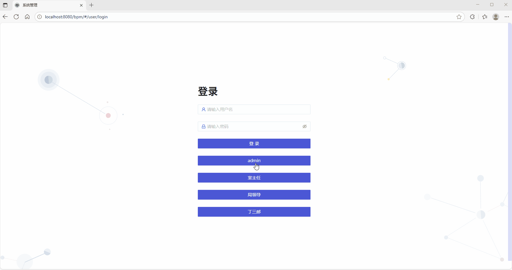
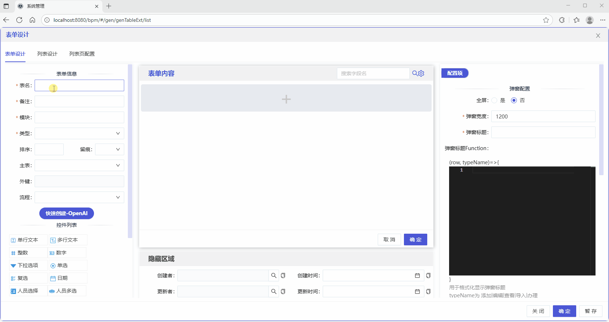
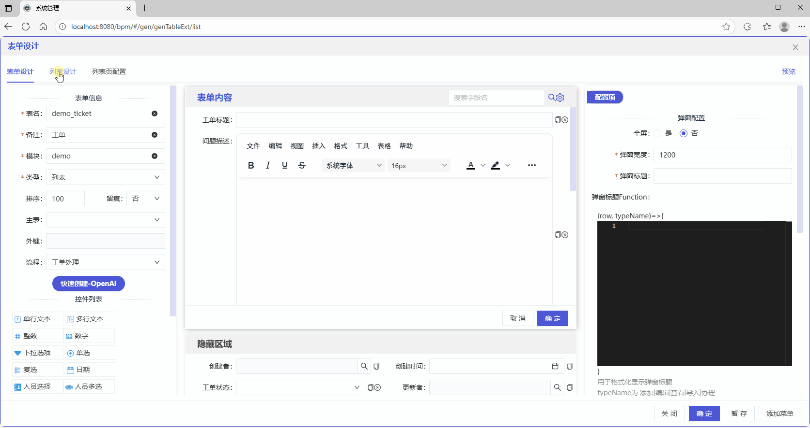
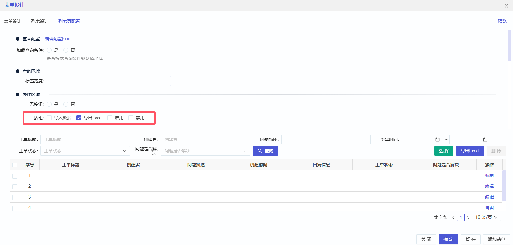

## 整个过程主要分为三个步骤

配置表单与数据库、设计工作流、配置权限与菜单。

### Step 1: 配置表单和数据库

<AccordionGroup>
  <Accordion title="进入表单管理页面">
    用开发超管admin登录进入系统，通过菜单”表单管理“进入列表页，过滤出模块名称是demo的表单，点”添加“按钮开启一个新的表单设计。

    
  </Accordion>
  <Accordion title="表单设计">
    输入表单信息，表名：**demo_ticket**，备注：**工单**，模块：**demo**，类型：**列表**，排序：**100**，留痕：**否**。

    点击”**快速创建-OpenAI**“，通过输入字段中文名称（名称用空格分隔），调用后端AI接口辅助创建表单元素（即数据库字段），其中工单状态status的java配置属性名称是固定的**status**，将其拖到表单隐藏区域。

    
  </Accordion>
  <Accordion title="列表设计">
    在"列表设计"标签页，选择需要组合查询的字段，是否查询选择”是“，查询类型文本一般选择Like支持模糊查询，日期范围选择Between。然后点击”同步字段title“按钮完成设置。

    下半部分是列表页效果预览，并不能直接操作数据。

    
  </Accordion>
  <Accordion title="列表页配置">
    在”列表页配置“标签页，操作区域，按钮，选择是否支持”导入数据“和”导出数据“。

    
  </Accordion>
</AccordionGroup>

### Step 2: 设计工作流

<AccordionGroup>
  <Accordion title="进入模型管理页面">
    Install the Mintlify GitHub app from your [dashboard](https://dashboard.mintlify.com/settings/organization/github-app).

    Our GitHub app automatically deploys your changes to your docs site, so you don't need to manage deployments yourself.
  </Accordion>
  <Accordion title="添加模型">
    For a first change, let's update the name and colors of your docs site.

    1. Open `docs.json` in your editor.
    2. Change the `"name"` field to your project name.
    3. Update the `"colors"` to match your brand.
    4. Save and see your changes instantly at `http://localhost:3000`.

    <Tip>
      Try changing the primary color to see an immediate difference!
    </Tip>
  </Accordion>
  <Accordion title="设计流程模型">
    
  </Accordion>
  <Accordion title="节点权限配置">
    
  </Accordion>
  <Accordion title="部署模型">
    
  </Accordion>
</AccordionGroup>

### Step 3: 配置权限和菜单

<AccordionGroup>
  <Accordion title="发布表单">
    1. Commit and push your changes.
    2. Your docs will update and be live in moments!
  </Accordion>
  <Accordion title="创建数据库表">
    
  </Accordion>
  <Accordion title="创建菜单">
    
  </Accordion>
  <Accordion title="配置角色和权限">
    
  </Accordion>
  <Accordion title="测试功能">
    
  </Accordion>
</AccordionGroup>

## 注意事项

Now that you have your docs running, explore these key features:

<CardGroup cols={2}>
  <Card title="Write Content" icon="pen-to-square" href="/essentials/markdown">
    Learn MDX syntax and start writing your documentation.
  </Card>
  <Card title="Customize style" icon="palette" href="/essentials/settings">
    Make your docs match your brand perfectly.
  </Card>
  <Card title="Add code examples" icon="square-code" href="/essentials/code">
    Include syntax-highlighted code blocks.
  </Card>
  <Card title="API documentation" icon="code" href="/api-reference/introduction">
    Auto-generate API docs from OpenAPI specs.
  </Card>
</CardGroup>

<Note>
  **Need help?** See our [full documentation](https://mintlify.com/docs) or join our [community](https://mintlify.com/community).

  
</Note>