## 整个过程主要分为三个步骤

配置表单与数据库、设计工作流、配置权限与菜单。实现“客户”创建工单和用户确认，“IT运维主管”分派工单，“运维人员”处理工单的业务流程。

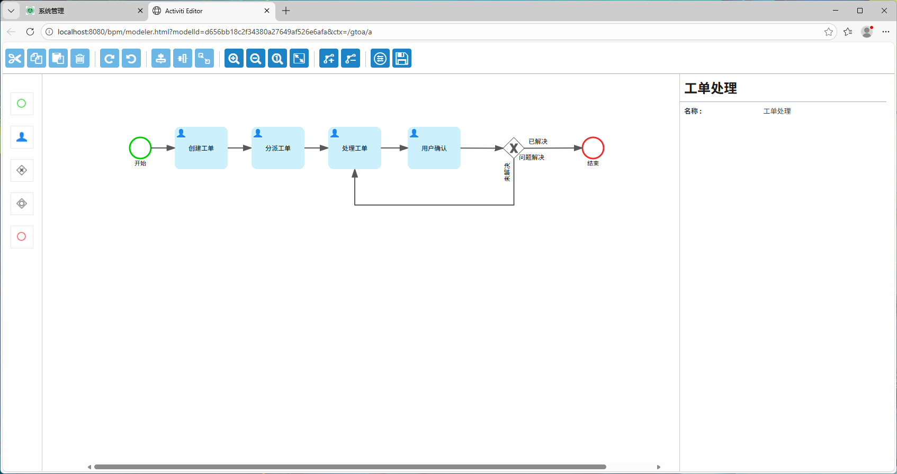

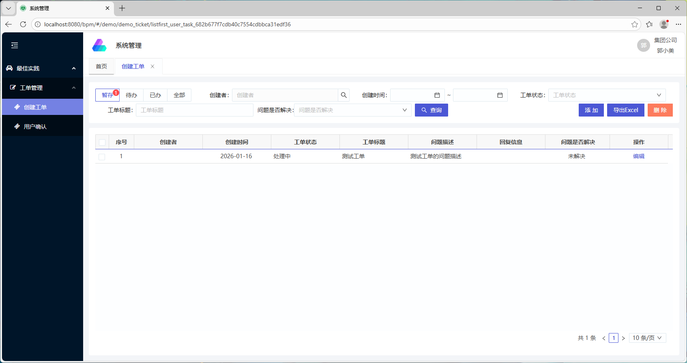

### Step 1: 配置表单和数据库

<AccordionGroup>
  <Accordion title="1. 进入表单管理页面">
    用开发超管admin登录进入系统，通过菜单”表单管理“进入列表页，过滤出模块名称是demo的表单，点”添加“按钮开启一个新的表单设计。

    
  </Accordion>
  <Accordion title="2. 表单设计">
    输入表单信息，表名：**demo_ticket**，备注：**工单**，模块：**demo**，类型：**列表**，排序：**100**，留痕：**否**。

    点击”**快速创建-OpenAI**“，通过输入字段中文名称（名称用空格分隔），调用后端AI接口辅助创建表单元素（即数据库字段），其中工单状态status的java配置属性名称是固定的**status**，将其拖到表单隐藏区域。

    
  </Accordion>
  <Accordion title="3. 列表设计">
    在"列表设计"标签页，选择需要组合查询的字段，是否查询选择”是“，查询类型文本一般选择Like支持模糊查询，日期范围选择Between。然后点击”同步字段title“按钮完成设置。

    下半部分是列表页效果预览，并不能直接操作数据。

    
  </Accordion>
  <Accordion title="4. 列表页配置">
    在”列表页配置“标签页，操作区域，按钮，选择是否支持”导入数据“和”导出数据“。

    
  </Accordion>
</AccordionGroup>

### Step 2: 设计工作流

<AccordionGroup>
  <Accordion title="1. 添加工作流模型">
    通过菜单”流程中心\\模型管理“进入列表页，点”添加“按钮，选择或新建流程分类，输入模型名称，这里的流程分类和模型名称都是“工单处理”。

    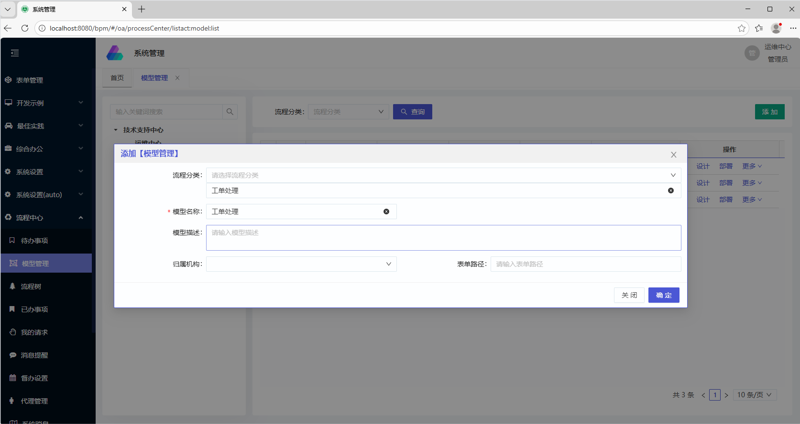
  </Accordion>
  <Accordion title="2. 设计工作流模型，关联表单">
    在“模型管理”列表页，点“设计”操作链接进入设计页面，如下图：

    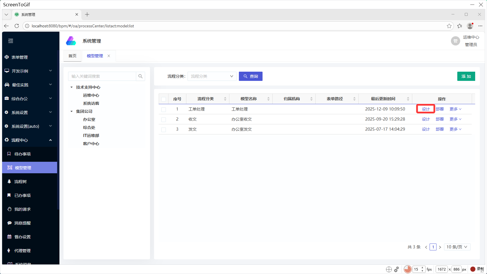

    创建流程节点和条件分支：

    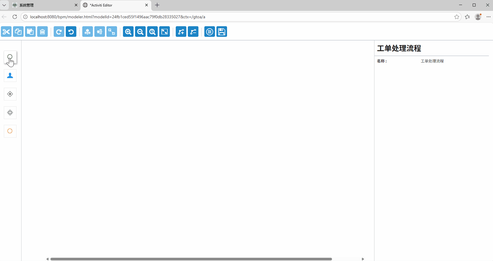

    重新返回表单设计页面，流程选择刚刚创建的“工单处理”工作流模型：

    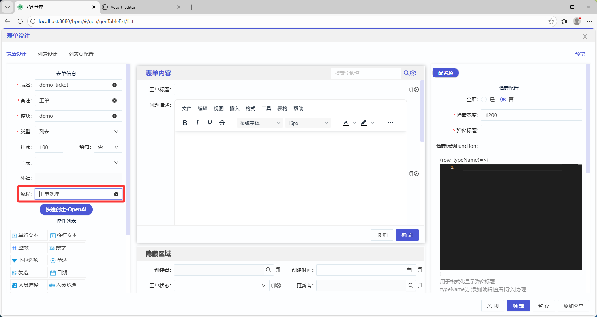
  </Accordion>
  <Accordion title="3. 节点权限配置">
    选中流程节点，点击右侧的代理和权限：权限配置，进入节点权限配置弹窗页面，配置人员范围和规则权限。

    创建工单节点，人员范围选择相对角色中的“发起者”；规则权限控制该节点表单元素是否可见、是否可编辑、是否必填，表单按钮选项控制该节点用户是否可以暂存、回退、终止流程，如下图所示：

    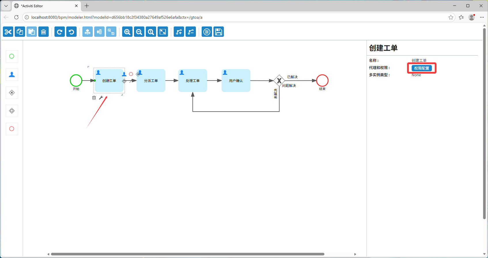

    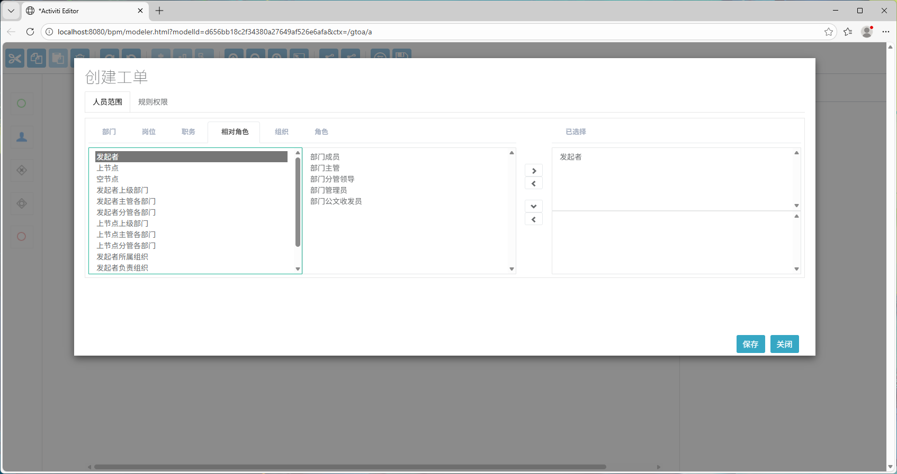

    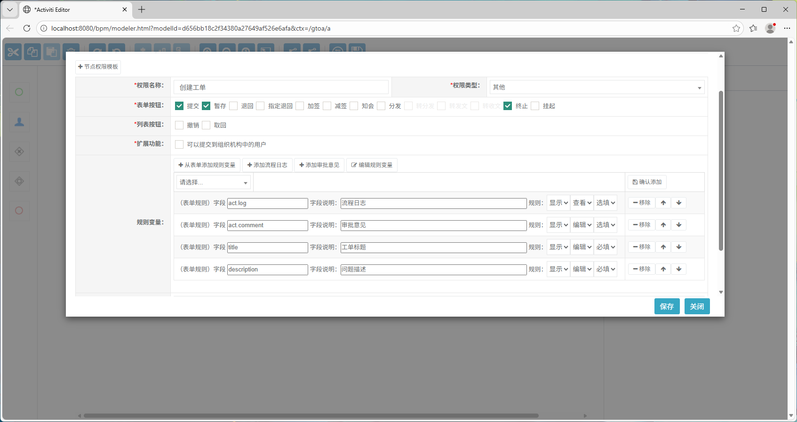

    依次配置其他节点的人员范围和规则权限。

    条件分支，流转方式选择Automatic自动，高级条件（变量）填写表单Java属性名称，高级条件（常量）填写数值，高级条件（运算）填写逻辑运算符，比如：等于。

    条件分支根据表单值控制流程走向。
  </Accordion>
  <Accordion title="4. 部署模型">
    在模型管理列表页的操作列，点击“部署”链接部署模型。

    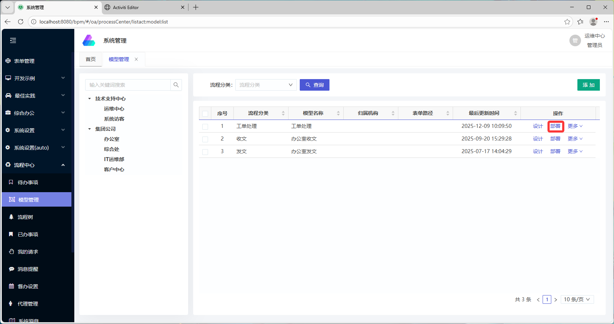
  </Accordion>
</AccordionGroup>

### Step 3: 配置权限和菜单

<AccordionGroup>
  <Accordion title="1. 发布表单">
    在表单管理列表页选择要发布的表单，点击“发布”按钮发布。

    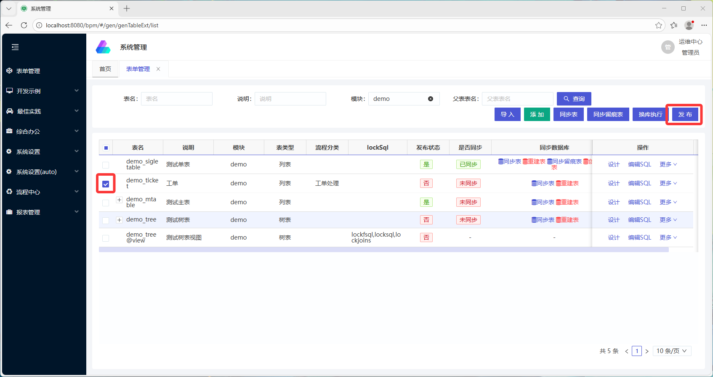
  </Accordion>
  <Accordion title="2. 创建数据库表">
    在表单管理列表页的操作列，点击“重建库”创建数据库表，表已存在数据时点击“同步表”增量修改数据库表。

    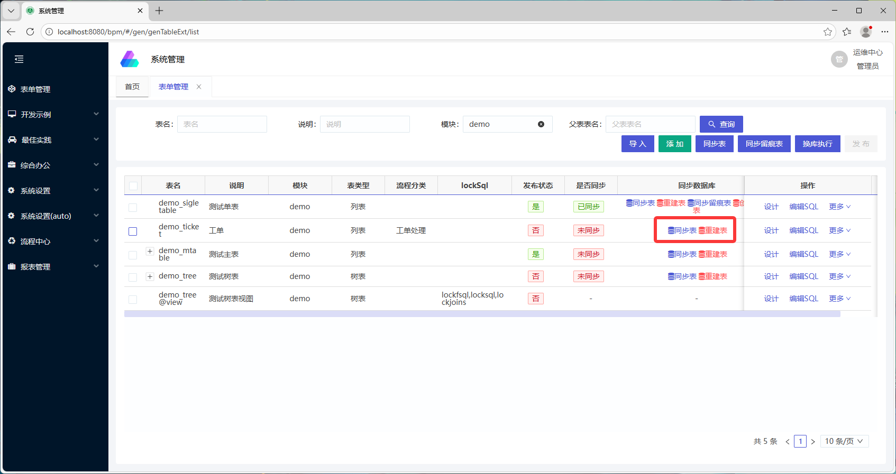
  </Accordion>
  <Accordion title="3. 创建菜单">
    在表单设计页面，右下方“创建菜单”，弹窗中选择上级菜单，输入链接（这里是/demo/demo_ticket/list），选择创建流程菜单。

    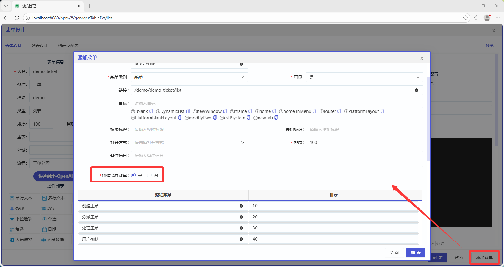
  </Accordion>
  <Accordion title="4. 配置角色和权限">
    在角色管理列表页的操作列，点击“权限设置”打开菜单权限设置页面。

    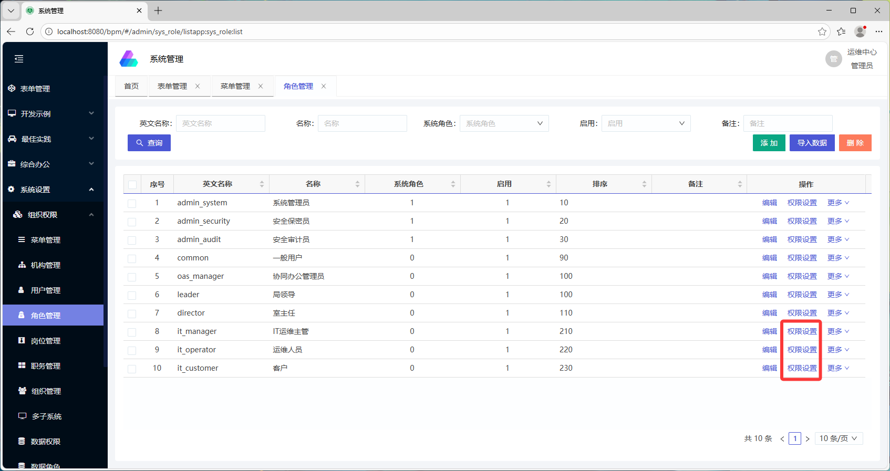

    选择该角色对应的菜单权限，这里客户角色对应创建工单和用户确认，运维人员对应处理工单，IT运维主管对应分派工单。

    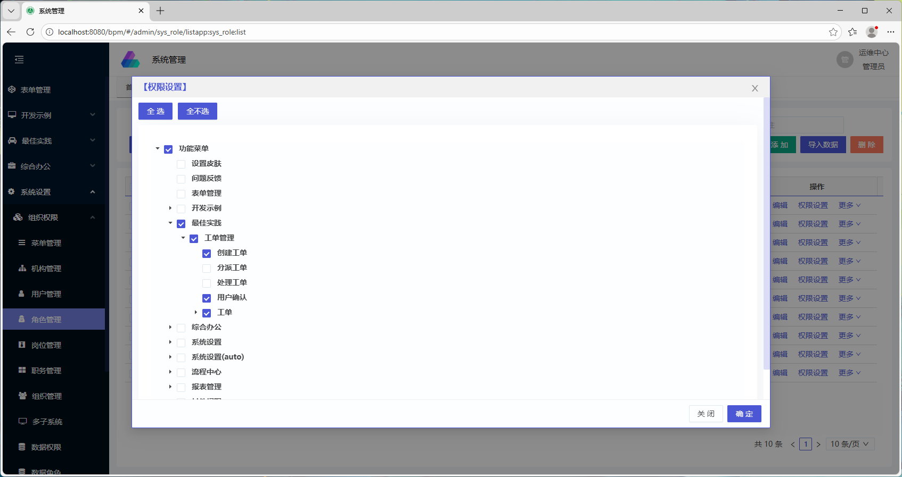
  </Accordion>
</AccordionGroup>